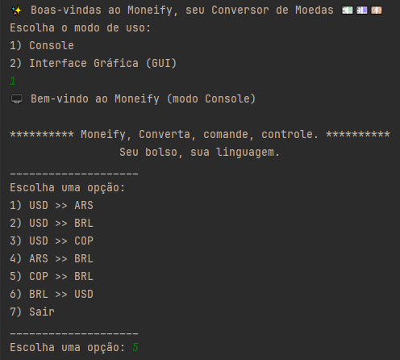
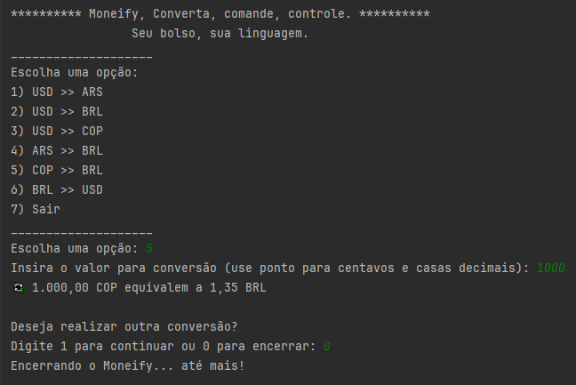
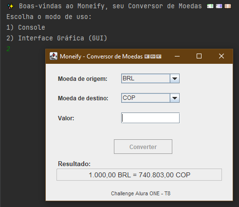
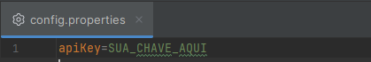

# 💱 Moneify
_Converta. Comande. Controle._
_Seu bolso, sua linguagem._
---

## ✨ Sobre o projeto

**Moneify** é um aplicativo Java desenvolvido como parte de um dos Desafios de formação _Alura Oracle Next Education ( T8 )_.  
Seu objetivo é permitir conversões entre moedas estrangeiras com cotação em tempo real, de forma acessível e visualmente organizada.

O projeto foi estruturado com foco em boas práticas, separação de responsabilidades e múltiplas interfaces de interação.

---

## 🎯 Funcionalidades

- Conversão entre moedas: USD, BRL, ARS, COP
- Consulta em tempo real usando a API _ExchangeRate_
- Interface gráfica via `Swing` para usuários visuais
- Modo console leve e direto para uso terminal
- Validações de entrada e mensagens dinâmicas
- Arquitetura modular (`model`, `service`, `gui`, `console`, `util`)

---

## 🔧 Tecnologias e ferramentas

- Java 17+
- Swing
- API ExchangeRate
- JSON Parsing via `org.json`
- Organização por pacotes: `model`, `service`, `gui`, `console`, `util`

---

## 🖥️ Modos de uso

### 1. Modo Console (CLI)

Navegação por opções no terminal, com leitura sequencial e formatação clara.

📸 *Execução inicial:*  


📸 *Encerramento da sessão:*  


### 2. Modo Gráfico (GUI)

Interface visual via Swing, com campos de seleção, validação e resultado centralizado.

📸 *Interface gráfica em execução:*  


---

## 🚀 Como executar

### ✅ Pré-requisitos
- Java **17 ou superior** instalado (Projeto testado com Java 21)
- Chave de API do [ExchangeRate](https://www.exchangerate-api.com/) válida

### 📦 Organização de pastas
```shell
src/
├── br.com.alura.moneify.console
├── br.com.alura.moneify.gui
├── br.com.alura.moneify.main
├── br.com.alura.moneify.model
├── br.com.alura.moneify.service
├── br.com.alura.moneify.util
config/
└── config.properties
```

### 🐚 Bash
```bash
javac -d out src/br/com/alura/moneify/main/MoneifyApp.java
java -cp out br.com.alura.moneify.main.MoneifyApp
```

### 🔐 Arquivo de configuração

O arquivo `config.properties` deve conter sua chave da API para funcionar corretamente com o conversor de moedas:

```properties
apiKey=SUA_CHAVE_AQUI
```

📸 *Exemplo de configuração do arquivo:*  


---

## 🙋 Créditos

- Desenvolvido por Mourassisana ✨
- Alura + Oracle Next Education
- Repositório público: [inserir link do GitHub aqui]

---

## 💬 Considerações

> Moneify não é só um conversor — ele virou símbolo 
> de uma narrativa que nasceu no meio da formação, cresceu entre refatorações sinceras, 
> e encontrou sentido na prática com intenção.
> 
>Construído linha por linha, entre ideias, dúvidas e descobertas, esse projeto carrega 
> o valor de quem transformou aprendizado em entrega: com atenção aos detalhes, paciência nos testes, 
> e presença em cada escolha.
>
>Foi feito entre madrugadas curiosas e aquele clássico “me perdi aqui” seguido de “caramba, acertei bonito!” 
> que só quem mergulha no código conhece.
>
>Agora, Moneify segue livre — pra quem quiser estudar, explorar, reaproveitar ou 
> simplesmente observar como uma jornada pode virar ferramenta. E se você chegou até aqui lendo 
> — seja por curiosidade, avaliação ou inspiração — que ele te converta também... não só moedas, mas ideias, 
> sentimentos e inspirações. 💡
>                                   
>Mourassisana
